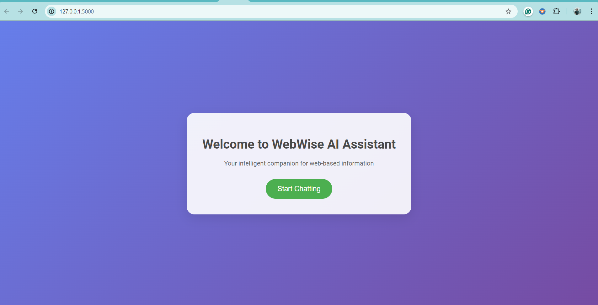
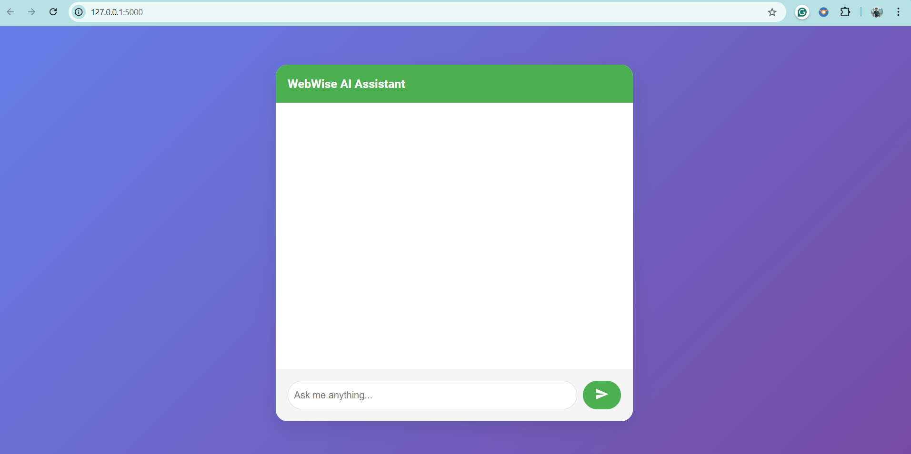
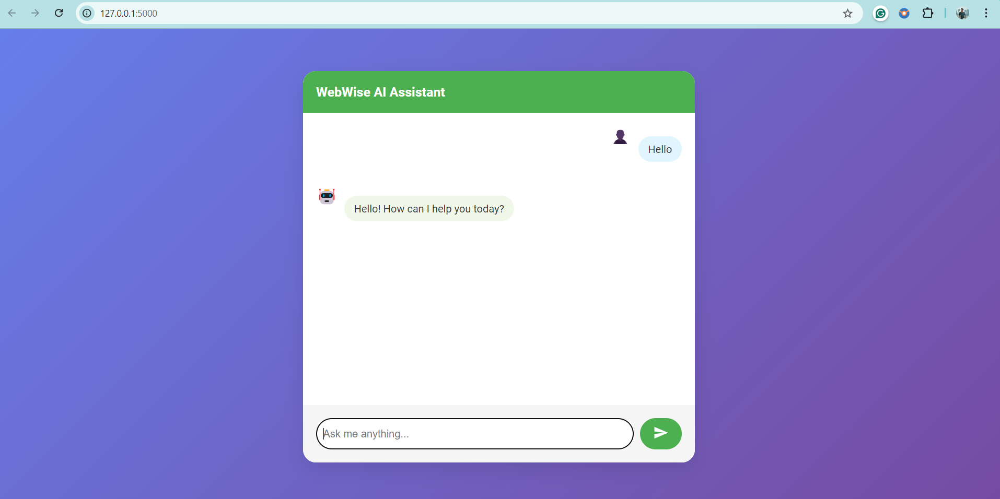

# Web Content Chatbot

A chatbot that retrieves and processes web content to answer user queries.

## Features

- Web content retrieval and processing
- Natural language interaction
- Responsive chat interface

## Screenshots

### Landing Page

### Chat Interface

### Example Conversation

## Installation
1. pip install flask
2. Open current directory using                  'cd web-llm-chatbot'
3. activate venv using                           'python -m venv venv'  then this command '.\venv\Scripts\Activate'
4. Import all necessary modules needed           'Pip install google.genrativeai' and 'Pip install dotenv'
5. Run the application: `python app.py`
6. Then if asks for any importing any modules import them and run again 

## Usage

1. Open the application in your web browser
2. Click "Start Chatting" o the landing page
3. Type your query into the chat input and press send
4. The chatbot will process your query and provide a response based on web content

## Technologies Used

- Flask
- BeautifulSoup
- Google Custom Search API
- Google Generative AI

Note: I plan to delete my API keys within a week, so please ensure you use your own API keys to get the desired output.
